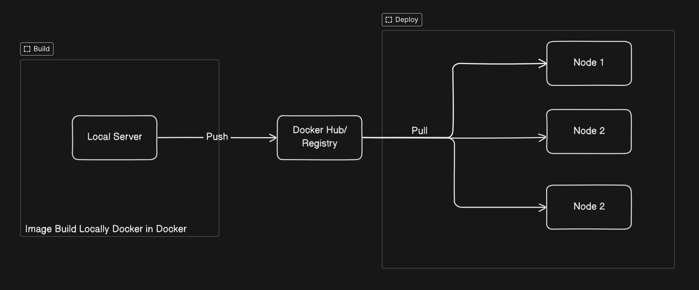

## 📜 What is Kamal?

Kamal (formerly MRSK) is an **open-source deployment tool** from the creators of Ruby on Rails. It provides a **zero-downtime deployment** process while keeping your infrastructure simple.

### 🔥 Key Features

✅ **Works with any server (bare metal, cloud, VPS)**  
✅ **Uses SSH for deployment (no Kubernetes needed)**  
✅ **Zero-downtime deployment with rolling updates**  
✅ **Built-in image caching for faster deployment**

Here’s a high-level view of how Kamal works:



---

## 🛠️ Setting Up Kamal

To use Kamal, ensure you have **Docker and SSH access** to your servers.

### 1️⃣ Install Kamal

First, install Kamal using RubyGems:

```sh
gem install kamal
```

### 2️⃣ Initialize Kamal in Your Project

```sh
kamal init
```

### 3️⃣ Configure Kamal

Edit the kamal.yml file to define your app name, registry, and servers:

```yaml
service: myapp
image: registry.example.com/myapp:latest
servers:
  - 192.168.1.10
  - 192.168.1.11
env:
  - DATABASE_URL=postgres://user:pass@db:5432/myapp
registry:
  username: mydockeruser
  password: "MY_DOCKER_PASSWORD"
```

## 🚀 Deploying Your App with Kamal

Now, deploy your application in three simple steps:

### 🏗️ 1. Build and Push Docker Image

Let's run:

```sh
kamal deploy

```

This will: ✅ Build the Docker image
✅ Push it to your container registry
✅ Deploy it on your servers

### 🔄 2. Rolling Updates

Kamal updates your app with zero downtime:

```sh
kamal deploy --rolling
```

### 📢 3. Rollback If Needed

If something goes wrong:

```sh
kamal rollback
```

## 🏆 Conclusion

Kamal is an excellent alternative to Kubernetes for simple deployments. It gives you the power of container orchestration without the complexity of Kubernetes.

🎯 Next Steps:

- Try deploying a real-world app with Kamal
- Explore Kamal’s official documentation
